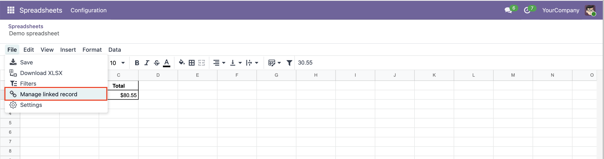
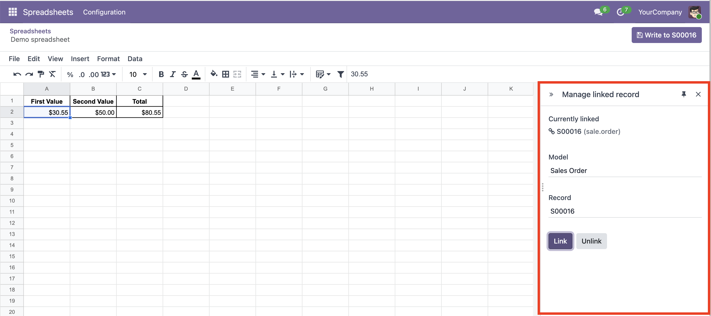
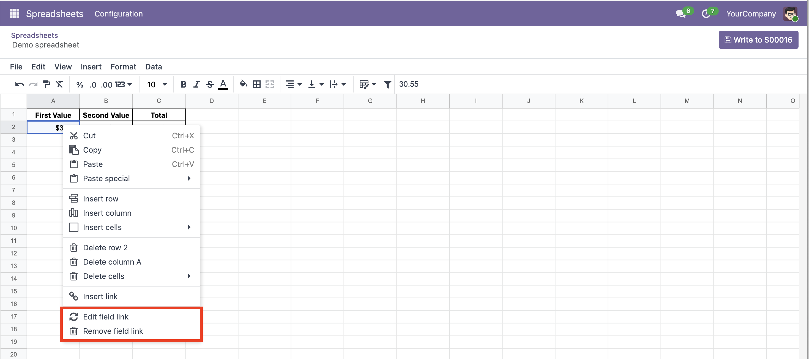
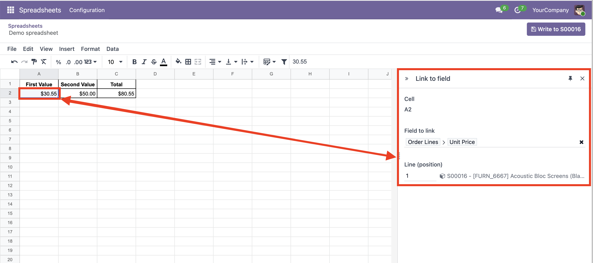
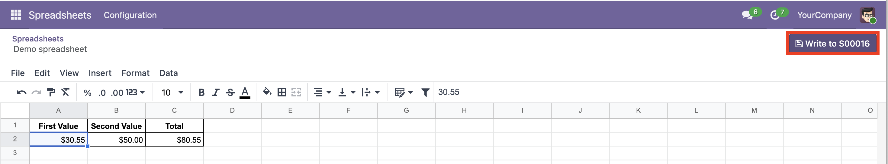

Everything happens from inside the spreadsheet editor, through two menus: the **File** menu at the top left, and the **cell menu** you get by right-clicking a cell.

## Link the spreadsheet to a record

Open any spreadsheet and go to **File → Manage linked record**. This entry is always available.

A side panel opens on the right:

- **Model** — pick the kind of record you want to link (Sale Order, Partner...). Only models you are allowed to edit are offered.
- **Record** — pick the specific record.
- **Link** — confirms the choice and links the spreadsheet to that record.
- **Unlink** — removes the link (shown only once a record is linked).

The top of the panel always shows which record is currently linked, if any.

## Link a cell to a field

Once the spreadsheet is linked, you can point cells at the record's fields. Right-click the cell that holds the value you want to send and choose **Link to field** (or, on a cell that is already linked, **Edit field link**). The same entry is also available under **File → Link to field**.

A side panel opens for that cell:

- **Field to link** — choose the field that should receive the cell's value. You can follow relations to reach a field of a related record, or a field on the record's lines.
- **Line (position)** — when the field lives on lines, tell the module which line to write to by its position (1 for the first line, 2 for the second...).

A short **Saved** confirmation appears each time a change is stored.

### Writing to lines, and creating new ones

Many records hold a list of lines — a sale order, for example, has its order lines. You can write to those lines by their position, and you can also add brand-new ones:

- **To update a line that already exists**, set its position (1, 2, 3...) to one that is already there.
- **To add a new line**, set a position just past the last one. Everything you mapped to that same position is gathered together into a single new line, so before you write, map every value the new line needs (description, quantity, price...) to that same position.

Positions follow the order the lines appear on the record's form: position 1 is the first line, 2 the second, and so on. Because of this, a position points at a *slot*, not at one particular line — if you reorder, add, or remove lines, a position may end up aiming at a different line than before, so it is worth a quick check after rearranging.

### A couple of limitations, and why they are there

To avoid making a mess, the module only ever *creates* new lines that belong directly to the record you linked — the record's own list of lines, like the lines of the sale order itself. Two things it will deliberately not do, and the reason for each:

- **It won't invent items that exist on their own.** Some fields don't hold lines that belong to the record; instead they point to things that live independently and can be shared by many records at once — think of the tags on a contact, or the product picked on a line. If one of those is already there, the module is glad to update a value on it. But it will not create a new one for you: doing that could quietly leave duplicates or half-finished entries scattered in other parts of Odoo that the rest of your data relies on. To stay safe, it only reuses what already exists in those spots.

- **It won't build a line hidden deep inside another line.** The module only adds lines one step down, directly on the record you linked. To create something nested further in — a line tucked inside another line — it would first have to invent the in-between lines that aren't there yet, filling in details you never entered. Rather than guess, it simply leaves those untouched.

So, in plain terms: the module creates a new line only where it can do so safely and without guessing — directly on the record you linked. Everywhere else it updates what is already there, but never creates.

## Remove a link from a cell

To unlink one or more cells, select them, right-click and choose **Remove field link**. This entry appears only when at least one cell in the selection is linked.

## Write the values back to the record

When the spreadsheet is linked to a record you can edit, a **Write to record** button appears in the top bar (it shows the record's name once one is linked, e.g. *Write to SO0042*). Click it to send every linked cell's current value to its field on the record at once.

