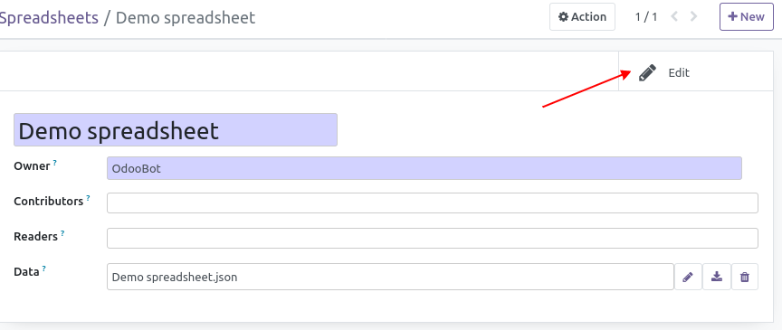
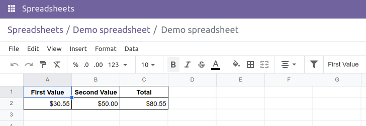
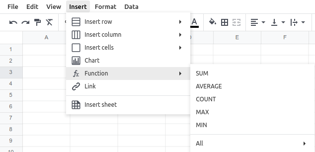

**Create a new spreadsheet**
~~~~~~~~~~~~~~~~~~~~~~~~~~~~

* Go to 'Spreadsheet' menu
* Click on 'Create'
* Put a name, then click on the "Edit" button

* At this point you switch to spreadsheet editing mode.
  The editor is named ``o-spreadsheet`` and looks like another common spreadsheet web editors.
  (OnlyOffice, Ethercalc, Google Sheets (non-free)).

* You can use common functions ``SUM()``, ``AVERAGE()``, etc. in the cells.
  For a complete list of functions and their syntax,
  Refer to the documentation https://github.com/odoo/o-spreadsheet/
  or go to https://odoo.github.io/o-spreadsheet/ and click on "Insert > Function".

* Note: Business Odoo module can add "business functions".
  This is currently the case for the accounting module, which adds the following features:

    * ``ODOO.CREDIT(account_codes, date_range)``: Get the total credit for the specified account(s) and period.
    * ``ODOO.DEBIT(account_codes, date_range)``: Get the total debit for the specified account(s) and period.
    * ``ODOO.BALANCE(account_codes, date_range)``: Get the total balance for the specified account(s) and period.
    * ``ODOO.FISCALYEAR.START(day)``: Returns the starting date of the fiscal year encompassing the provided date.
    * ``ODOO.FISCALYEAR.END(day)``: Returns the ending date of the fiscal year encompassing the provided date.
    * ``ODOO.ACCOUNT.GROUP(type)``: Returns the account ids of a given group where type should be a value of the ``account_type`` field of ``account.account`` model.
      (``income``, ``asset_receivable``, etc.)
