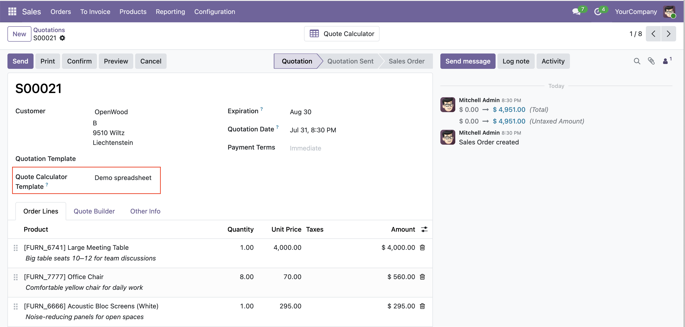
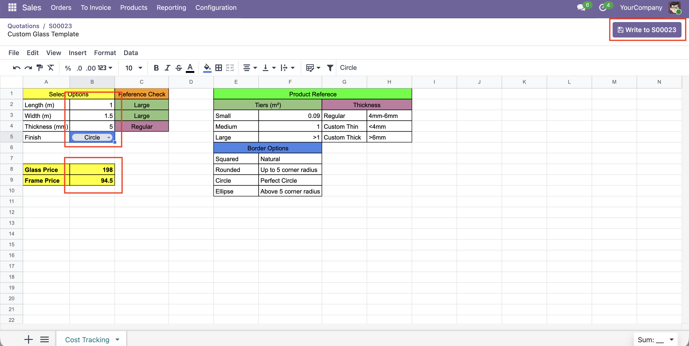

The quote calculator is set up once on a quotation template, though, then rides along on every quote made from that template. It works out of the box — there is nothing to configure. Everything below happens with ordinary spreadsheet formulas and the linking tools from **spreadsheet_field_linking**.

## Prepare the calculator on a quotation template

Go to **Sales → Configuration → Quotation Templates** and open (or create) a template, adding its lines as usual. In the **Quote Calculator** field, create a new spreadsheet and open it — it starts empty, ready for whatever calculation you need.

Build your calculation with normal formulas: the inputs, the intermediate steps, and the result cells you want to end up on the order.

Then link each **result cell** to the order-line field it should feed — unit price, quantity, discount, the product on a line, and so on. Linking a cell to a field, and choosing which line it targets, is done with the tools from **spreadsheet_field_linking**; see its documentation for how. The mappings live inside the spreadsheet, so they travel with every copy.

## Attach a calculator to a quotation

There are two ways to give an order a calculator:

- **From a quotation template** — on a new quotation, choose a **quotation template** that carries a calculator and the order picks it up automatically. This is the usual route, since one template serves every quote made from it.
- **Directly on the order** — pick a spreadsheet in the **Quote Calculator Template** field of the order itself, with no quotation template involved. Handy for a one-off quote or an ad-hoc calculation.

Either way a **Quote Calculator** smart button appears. Choosing the template or the spreadsheet copies nothing on its own — it only points the order at the calculator to use. The private copy is made when you **first click the button**, which is why the button can show before any spreadsheet exists yet. From then on the button just reopens that copy, so your changes never affect the shared original or any other quote.

## Run the calculator and write the values back

Click the **Quote Calculator** smart button to open the editor and adjust your input values.

When you are happy with the result, click **Write to record** in the top bar. For each linked cell the current value is read, checked against the field's type, and written onto the matching order line; the workbook is saved at the same time. Because the order lines are created from the template lines in the same order, position `1` still points at the first line after the quote is made, so nothing has to be re-mapped on copy.

## Change or rebuild the calculator

If you switch the quotation template — or the chosen calculator — after a copy already exists, a **Rebuild Calculator** button appears next to the field. It discards the current copy and rebuilds a fresh one from the new template, which is handy when the template's calculator has been improved. The inputs in the old copy are lost, so it asks for confirmation first.

## Good to know

- The sync is one-way: the spreadsheet writes onto the order, never the other way around.
- It only runs when you click **Write to record**, so editing the sheet never changes the order on its own.
- The **Quote Calculator** button is what creates the order's private copy, on its first click; selecting a template or spreadsheet only sets which calculator to copy. That is why the button can appear while no spreadsheet exists yet.
- An **empty** cell clears its field to the empty value (`0`, blank text, no relation).
- Which fields can be reached, how line positions are counted, and when a new line is created (or deliberately not) are all handled by **spreadsheet_field_linking** — see its documentation for the details and limitations.
